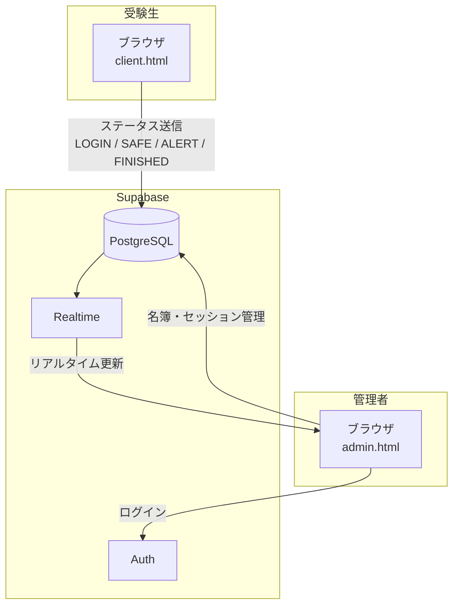
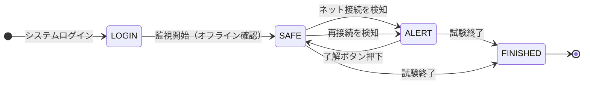
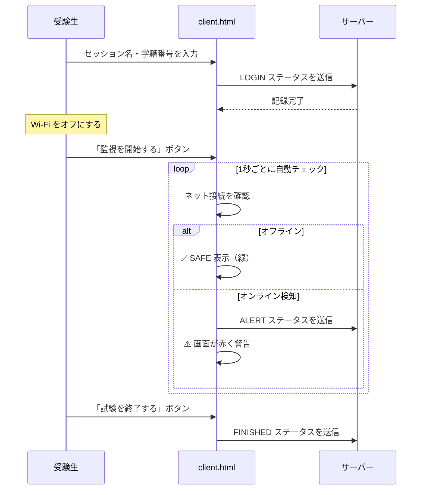
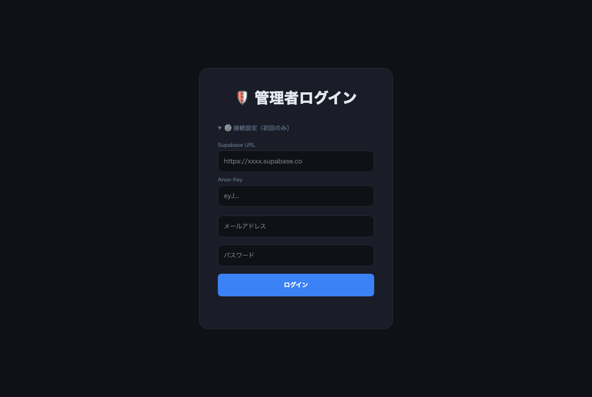
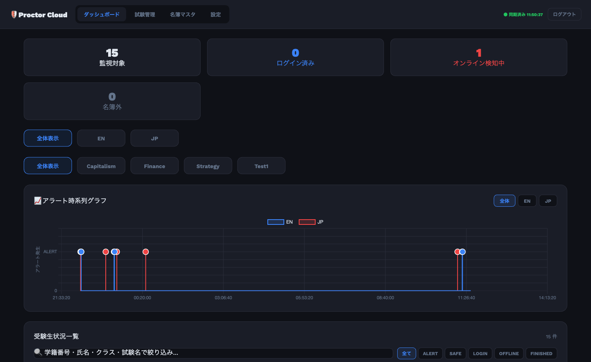
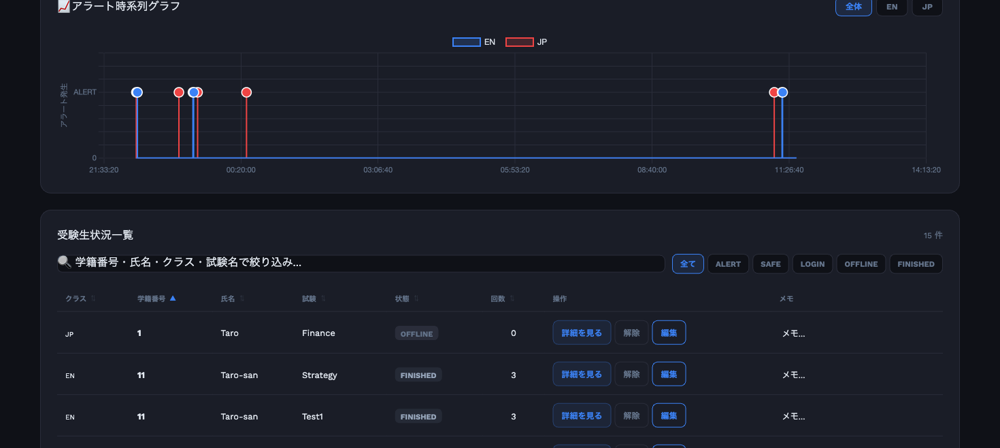
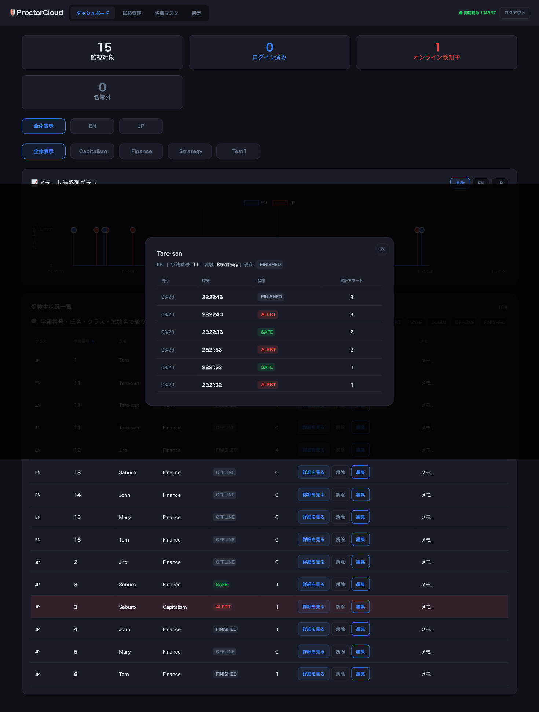
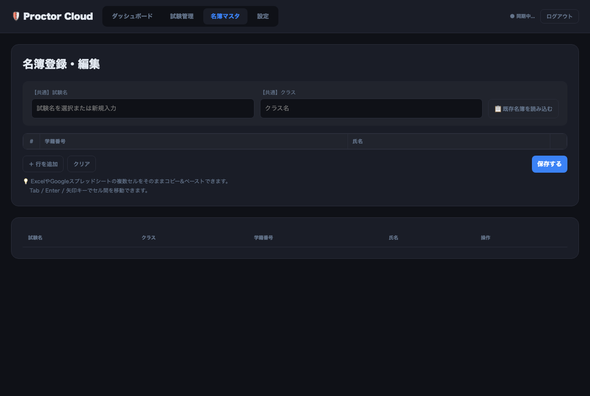
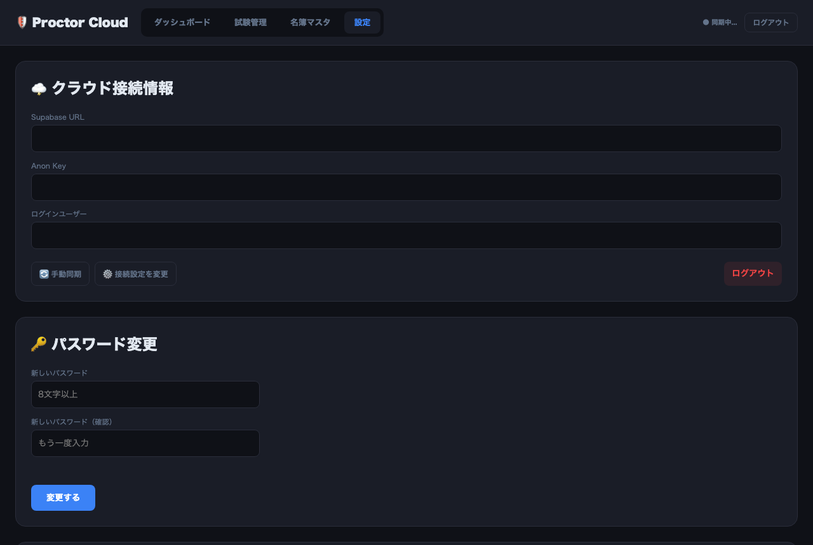
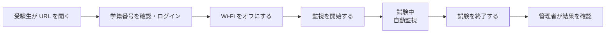

# 🛡️ ExamProctor — オンライン試験ネット接続監視システム

試験中の受験生がインターネットに接続しているかどうかを、**リアルタイムで監視・記録**するWebアプリケーションです。
受験生のブラウザ上で動作し、管理者はダッシュボードで全員の状況を一目で確認できます。

---

## 📋 目次

- [できること](#-できること)
- [システム構成](#-システム構成)
- [ステータスの種類](#-ステータスの種類)
- [受験生の流れ](#-受験生の流れ)
- [管理者ダッシュボード](#-管理者ダッシュボード)
- [セットアップ](#-セットアップ)
- [使い方](#-使い方)

---

## ✨ できること

### 受験生側
| 機能 | 説明 |
|---|---|
| システムログイン | 学籍番号・セッション名で入室を記録 |
| オフライン案内 | 監視開始前に Wi-Fi オフを促す画面 |
| ネット接続の自動検知 | 1秒ごとに接続状態をチェック |
| リアルタイム警告 | 接続を検知すると画面が赤く警告 |
| オフライン時の保留同期 | 切断中でも、復帰時に自動でサーバーへ送信 |
| 試験終了 | ボタン1つで監視を終了・記録 |

### 管理者側
| 機能 | 説明 |
|---|---|
| リアルタイムダッシュボード | 全受験生のステータスを自動更新 |
| アラート時系列グラフ | アラートが発生した時刻をスパイク型グラフで可視化 |
| 詳細履歴モーダル | 受験生ごとのステータス変化を時系列で確認 |
| クラス・セッションフィルター | 対象を絞り込んで表示 |
| 名簿マスター管理 | Excel・Google スプレッドシートからそのまま貼り付け |
| ソート・テキスト検索 | 一覧を自由に並べ替え・絞り込み |
| メモ機能 | セッションごとに受験生へのメモを記録 |
| 論理削除・ゴミ箱 | 誤削除時にデータを復元可能 |
| 一括削除 | セッション・クラスを指定してまとめて削除 |
| Supabase Auth 認証 | メールアドレス＋パスワードで安全にログイン |

---

## 🏗️ システム構成



---

## 📊 ステータスの種類



| ステータス | 意味 |
|---|---|
| 🔵 **LOGIN** | システムにログインした（監視未開始） |
| 🟢 **SAFE** | オフラインを確認済み、問題なし |
| 🔴 **ALERT** | インターネット接続を検知 |
| ⚫ **OFFLINE** | まだ監視データなし |
| ✅ **FINISHED** | 試験終了 |

---

## 👨‍🎓 受験生の流れ



---

## 🖥️ 管理者ダッシュボード

### ① ログイン画面
Supabase の接続情報（初回のみ）とメールアドレス・パスワードで安全にログインします。



---

### ② ダッシュボード
受験生全員のステータスをリアルタイムで一覧表示します。
アラートが発生した受験生は**行が赤くハイライト**され、画面上部のカウンターで件数を確認できます。



**主な操作：**
- ステータスフィルター（ALERT / SAFE / LOGIN / OFFLINE / FINISHED）で絞り込み
- 学籍番号・氏名・クラス・試験名でテキスト検索
- 列ヘッダークリックで昇順・降順ソート
- 「解除」ボタンでアラートを SAFE に変更
- 「詳細を見る」でステータス履歴を確認

---

### ③ アラート時系列グラフ
アラートが発生した**その瞬間だけ**Y軸が上に触れるスパイク型グラフ。
クラス別タブで色分け表示され、スパイクをクリックすると発生した受験生の詳細が表示されます。



---

### ④ 詳細履歴モーダル
受験生ごとのステータス変化を時系列で確認できます。
グラフのスパイクをクリックすると、対応するレコードが自動的にハイライト・スクロールされます。



---

### ⑤ 名簿マスター管理
Excel や Google スプレッドシートのデータを**そのままコピー＆ペースト**で登録できるグリッド UI。
学籍番号・氏名・クラス・セッションを一括で登録できます。



---

### ⑥ 設定画面
- セッション（試験回）の追加・削除
- データの一括削除（セッション・クラスでフィルター）
- ゴミ箱（論理削除されたデータの確認・復元）
- パスワード変更



---

## ⚙️ セットアップ

### 必要なもの
- [Supabase](https://supabase.com) アカウント（無料プランで動作します）

### 1. Supabase でテーブルを作成

SQL Editor で [`supabase_history.sql`](supabase_history.sql) と [`supabase_soft_delete.sql`](supabase_soft_delete.sql) を順番に実行します。

その後、認証済みユーザー向けにポリシーを追加します：

```sql
-- 管理者（authenticated）に全テーブルへのアクセス権を付与
CREATE POLICY "allow_auth_all" ON public.sessions
  FOR ALL TO authenticated USING (true) WITH CHECK (true);
GRANT ALL ON public.sessions TO authenticated;

CREATE POLICY "allow_auth_all" ON public.students
  FOR ALL TO authenticated USING (true) WITH CHECK (true);
GRANT ALL ON public.students TO authenticated;

CREATE POLICY "allow_auth_all" ON public.exam_status
  FOR ALL TO authenticated USING (true) WITH CHECK (true);
GRANT ALL ON public.exam_status TO authenticated;

CREATE POLICY "allow_auth_all" ON public.exam_status_history
  FOR ALL TO authenticated USING (true) WITH CHECK (true);
GRANT ALL ON public.exam_status_history TO authenticated;
```

### 2. Supabase Auth で管理者アカウントを作成

Supabase ダッシュボード → **Authentication → Users → Add user** で管理者アカウントを作成します。

### 3. デプロイ

| 方法 | ブランチ | 特徴 |
|---|---|---|
| GitHub Pages | `build` | 無料、静的ホスティング、難読化済み |
| Vercel | `vercel` | サーバーサイドAPI付き、Supabase認証情報がブラウザに届かない |

---

## 📖 使い方

### 受験生への URL 配布

```
https://your-domain.com/client.html?topic=セッション名&sid=学籍番号
```

`topic` と `sid` を URL パラメータで渡すと自動入力されます。クラス全員分の URL を一括で案内するとスムーズです。

### 試験当日の流れ



### 管理者の操作手順

1. **事前準備**
   - 試験管理タブでセッション名を登録
   - 名簿マスタタブで受験生情報を Excel から貼り付け

2. **試験中**
   - ダッシュボードでリアルタイム監視
   - ALERT が出た受験生を確認・メモ記入
   - グラフでアラート発生時刻を追跡

3. **試験後**
   - 詳細履歴でアラートの記録を確認
   - 設定タブからデータをアーカイブ・削除

---

## 🔒 セキュリティについて

- 管理画面は **Supabase Auth**（メール＋パスワード）で保護
- データ削除は**論理削除**（ゴミ箱に移動）で誤操作から保護
- Vercel デプロイ時は Supabase 認証情報がブラウザに届かない設計

---

## 🗂️ ブランチ構成

| ブランチ | 説明 |
|---|---|
| `main` | 開発用ソース（読みやすい状態） |
| `build` | GitHub Pages 用（Vite ビルド＋難読化） |
| `vercel` | Vercel 用（サーバーサイド API＋難読化） |

---

## 📄 ライセンス

MIT License
